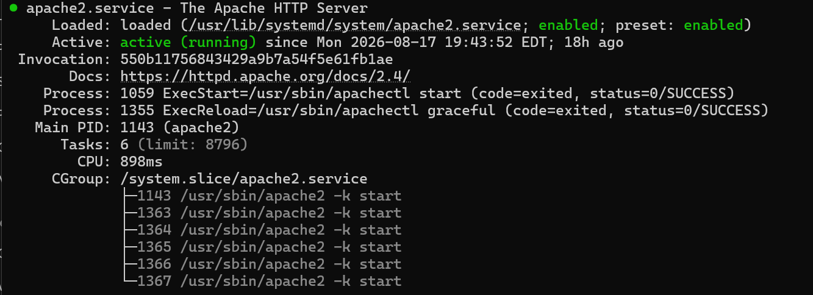
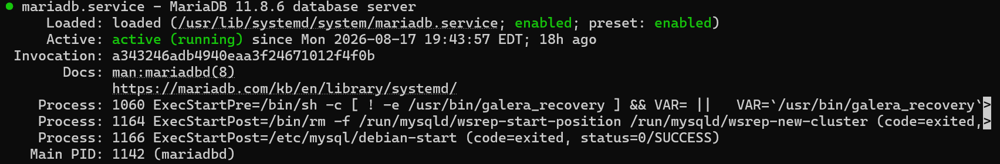
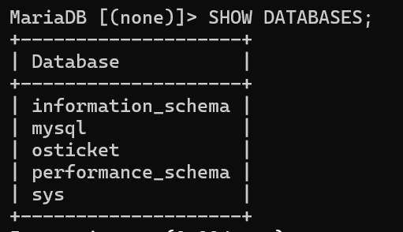
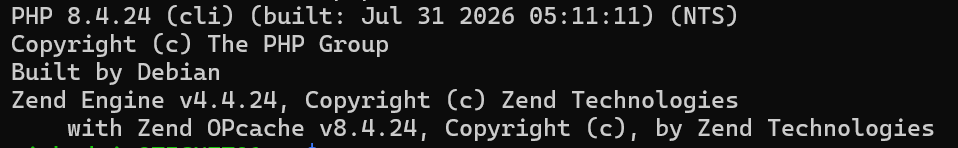
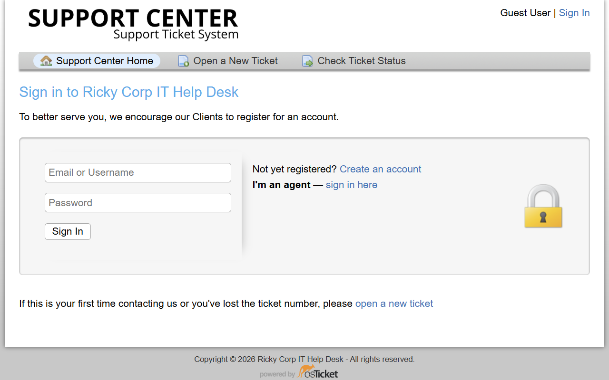
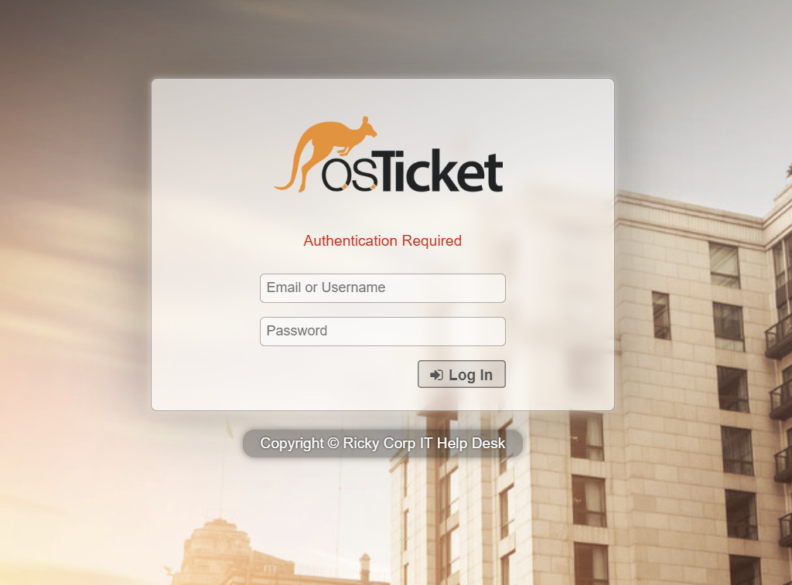
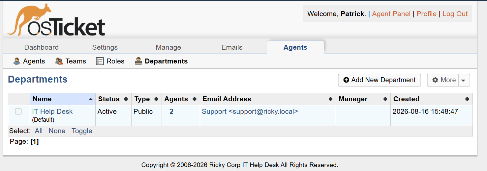
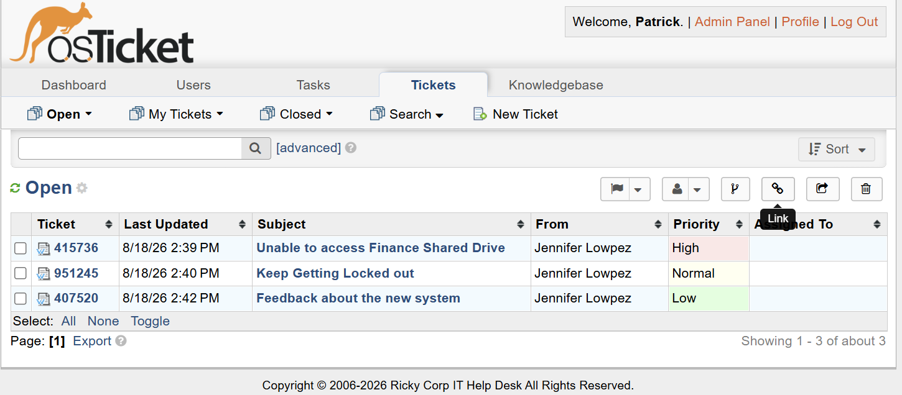
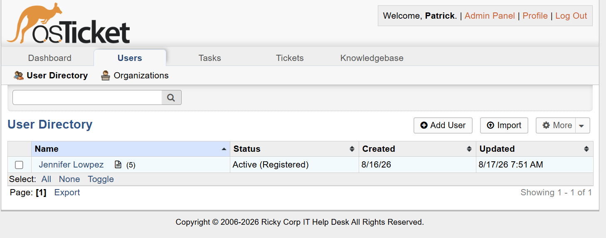
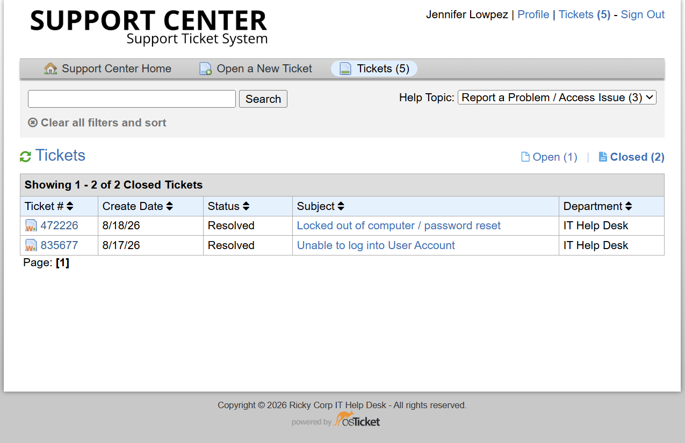

# 🎫 osTicket Help Desk Environment
Hands-on osTicket help desk lab simulating an enterprise IT Support hosted on a Raspberry Pi

## Introduction
In this lab I used a Raspberry Pi to host osTicket to simulate common IT support and ticketing workflows in an enterprise environment. On the Raspberry pi I configured Secure Shell during the imaging process and did all configurations through the command line on a different workstation. osTicket is locally hosted on the Pi using an Apache server with a SQL database to store ticket data.

## The lab includes:

- ✅ Apache web server configuration
- ✅ MySQL/MariaDB database configuration
- ✅ PHP configuration
- ✅ osTicket installation and deployment
- ✅ Help desk users and agents
- ✅ Departments and support teams
- ✅ Ticket priorities and SLAs
- ✅ Help topics and ticket categorization
- ✅ Ticket assignment and escalation
- ✅ Simulated end-user support requests
- ✅ Ticket troubleshooting and resolution
- ✅ Active Directory help desk scenarios

## Architecture
osTicket uses a multi-tier web application architecture. Apache provides a web server that will handle HTTP requests, PHP is used for the application code, and the MariaDB database provides a storage space for users, tickets, departments, and configurations. I don't go over setting up the Apache server, installing PHP, or setting up the databsse but the screenshots below show that they are running on the Pi

CLI Command: sudo systemctl apache2

 

CLI Command: sudo systemctl mariadb

CLI Command: php --version

## 🎫 osTicket Deployment & Help Desk Environment
If you check out my Active Directory lab you'll see that I set up an environment to simulate a real enterprise operation. This lab is an extension of that one and we'll be logging into a simulated IT Agents profile to work tickets. The portal allows user to authenticate, submit new tickets, and work through them if you are in the help desk admin department.

User Login

Agent Login

## 🏢 Help Desk Configuration
I configured an IT Help Desk department inside of osTicket to provide a destination for support requests. I assigned 2 agents (1 Help Desk Admin & 1 System Admin) that are able to receive, manage, and resolve tickets by submitted users. I configured it so that the help desk can work tickets but they can't create new users or delete tickets. Only the system admin has full control. 

I also added a user that can login on their own to submit new tickets. I would have created more to simulate an enterprise environment better but I have to use actual emails to make employees and I didnt want to make 20 fake emails. This means that the one user will submit tickets on behalf of the whole company. This is demonstrated below with a few tickets that are open and a few that have been resolved. 

